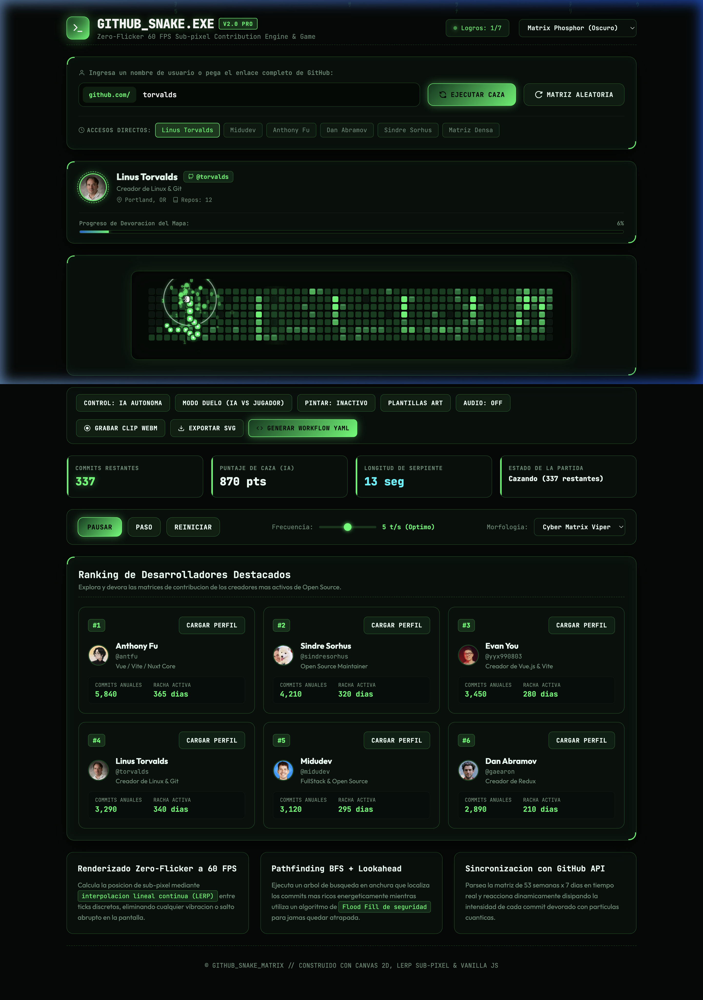
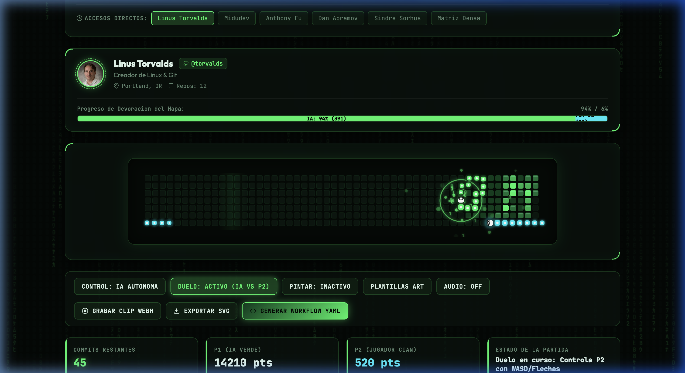
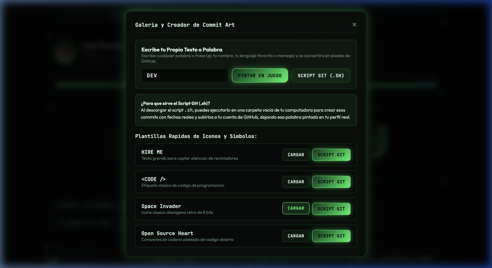

# GITHUB_SNAKE.EXE // PRO EDITION v2.0

<p align="center">
  
</p>

<p align="center">
  <a href="https://luisrodriguez-rgb.github.io/GITHUB_SNAKE.EXE/">
    
  </a>
</p>

<p align="center">
  
  
  
  
  
</p>

---

> [!TIP]
> **Acceso Directo a la Aplicacion Desplegada**:  
> Puedes jugar, simular perfiles y generar tus scripts de Commit Art directamente desde la web en:  
> **https://luisrodriguez-rgb.github.io/GITHUB_SNAKE.EXE/**

---

## Descripcion General

**GITHUB_SNAKE.EXE** es un motor de simulacion interactiva, emulacion de perfiles y videojuego en tiempo real construido sobre Canvas 2D. Utiliza **interpolacion lineal continua (LERP)** para lograr un movimiento a 60 FPS sin saltos ni parpadeos (Zero-Flicker), navegacion autonoma inteligente con **BFS + Flood Fill de seguridad**, modo duelo multijugador, soporte de grabacion de video HD nativo, tooltips interactivos estilo GitHub y un generador de **Commit Art** para transformar texto en scripts de Git listos para pintar tu perfil real de GitHub.

---

## Galeria Visual de Funcionalidades

### 1. Interfaz Principal y Simulacion a 60 FPS
Explora perfiles reales de GitHub (Linus Torvalds, Anthony Fu, Midudev, etc.) o matrices aleatorias densas con renderizado sub-pixel de alta definicion.
<p align="center">
  
</p>

---

### 2. Modo Duelo: IA Verde vs Jugador Cian
Compite contra la inteligencia artificial en tiempo real. La pantalla divide la barra de progreso superior mostrando el porcentaje de mapa conquistado y puntos obtenidos por cada serpiente hasta purificar el 100% de la matriz.
<p align="center">
  
</p>

---

### 3. Creador de Texto "Commit Art" & Generador de Scripts Git (.sh)
Escribe cualquier palabra (ej: tu nombre, tu lenguaje favorito o mensaje) y el motor la convertira en una matriz bitmap de GitHub con commits organicos. Descarga el script `.sh` automatizado para pintar ese dibujo en tu perfil real de GitHub.
<p align="center">
  
</p>

---

## Caracteristicas Principales

* **Renderizado Zero-Flicker a 60 FPS**:
  * Desacoplamiento de la logica de ticks y el refresco visual mediante interpolacion continua LERP (`x(t) = x_prev + (x_next - x_prev) * progress`).
  * Contornos de alto contraste y columna vertebral laser blanca para evitar que la serpiente se pierda en fondos oscuros.
  * Transicion toroidal perfecta (Ghost Segments) al cruzar los limites laterales y verticales sin cortes en pantalla.
* **Tooltip Interactivo Estilo GitHub**:
  * Muestra en tiempo real la cantidad exacta de contribuciones (`14 contribuciones`), la fecha formateada en espanol (`el 14 de mayo de 2025`) y el nivel de actividad al pasar el cursor sobre cualquier celda.
* **Sistema de Puntuacion y Pantalla de Fin de Partida**:
  * Puntos proporcionales al nivel de commit: Nivel 1 = 10 pts, Nivel 2 = 25 pts, Nivel 3 = 50 pts, Nivel 4 = 100 pts.
  * Modal de Victoria/Game Over con desglose de porcentaje de tablero conquistado y boton de revancha.
* **Navegacion Autonoma Inteligente (BFS + Flood Fill)**:
  * Busqueda de la ruta mas corta hacia los commits mas densos con lookahead de seguridad para prevenir colisiones y trampas.
* **Creador de Palabras Personalizadas**:
  * Motor tipografico matricial 3x5 y 4x5 que centra cualquier texto y asigna intensidades organicas y realistas.
* **Grabador de Video HD WebM Integrado**:
  * Captura nativa a 60 FPS directamente desde el canvas con MediaRecorder sin necesidad de extensiones externas.
* **Sintesis de Audio Cyberpunk (Web Audio API)**:
  * Generacion procedimental de frecuencias con osciladores y filtros en tiempo real (mordiscos, ondas de choque y clics de interfaz).
* **Exportador de SVG Animado y GitHub Actions**:
  * Exporta SVG con animacion en bucle del 100% de la partida y genera el workflow `.github/workflows/snake.yml`.
* **Componente Web Independiente (`embed.js`)**:
  * Etiqueta `<github-snake user="torvalds" theme="dark"></github-snake>` reutilizable para cualquier pagina o portafolio personal.
* **Sistema de Logros y Medallas**:
  * 7 medallas desbloqueables con notificaciones Cyber Toast y persistencia en LocalStorage.

---

## Arquitectura y Flujo de Datos

```
+-------------------------------------------------------------------------+
|                              CAPA DE ENTRADA                            |
|    GitHub API REST  |  Palabras Commit Art  |  WASD / Flechas Teclado   |
+------------------------------------+------------------------------------+
                                     |
                                     v
+-------------------------------------------------------------------------+
|                         MATRIZ DE CONTRIBUCIONES                        |
|              Estructura normalizada de 53 columnas x 7 filas            |
|              Fechas calculadas, conteos dinamicos y niveles 0-4         |
+------------------------------------+------------------------------------+
                                     |
                                     v
+-------------------------------------------------------------------------+
|                     MOTORES LOGICOS Y PATHFINDING                       |
|   - IA Verde: Busqueda BFS con lookahead de seguridad Flood Fill        |
|   - P2 Cian: Control manual con normalizacion de direccion toroidal     |
|   - Scoring: Puntos por nivel de intensidad y deteccion de fin de juego |
+------------------------------------+------------------------------------+
                                     |
                                     v
+-------------------------------------------------------------------------+
|                     MOTOR DE RENDERIZADO CANVAS 2D                      |
|   - requestAnimationFrame a 60 FPS con LERP sub-pixel                   |
|   - Contorno de alto contraste + Columna vertebral laser brillante      |
|   - Ondas de choque (Shockwaves), particulas de codigo y scanlines      |
|   - Tooltip flotante dinamico sincronizado con coordenadas de mouse     |
+-------------------------------------------------------------------------+
```

---

## Estructura del Proyecto

```
.
|-- index.html            # Estructura semantica, HUD, tooltips, modales y canvas
|-- style.css             # Design tokens, paletas de color, efectos glassmorphism
|-- embed.js              # Web Component autonomo <github-snake> para portafolios
|-- assets/               # Capturas de pantalla, previews y recursos visuales
|   |-- hero_preview.png  # Captura de interfaz principal
|   |-- duel_mode.png     # Captura del modo duelo IA vs Jugador
|   |-- commit_art.png    # Captura del creador de Commit Art
|   `-- demo_recording.webp # Grabacion de sesion
|-- js/
|   |-- achievements.js   # Sistema de medallas, persistencia y eventos
|   |-- audio.js          # Sintetizador procedural Web Audio API
|   |-- exporter.js       # Exportador SVG con barrido 100% y generador YAML
|   |-- github.js         # API Fetcher, calculo de fechas y ranking de devs
|   |-- pathfinding.js    # Algoritmo BFS y evaluacion de seguridad Flood Fill
|   |-- recorder.js       # Motor de grabacion HD WebM en navegador
|   |-- renderer.js       # Renderizado Canvas 2D con alto contraste y LERP
|   |-- snake.js          # Maquina de estados, segmentos y particulas
|   |-- templates.js      # Rasterizador de fuentes bitmap y scripts Bash Git
|   `-- app.js            # Orquestador maestro, bucle principal y eventos DOM
|-- README.md             # Documentacion tecnica del repositorio
`-- snake_link.md         # Especificacion matematica de algoritmos
```

---

## Ejecucion en Local

1. **Clonar el repositorio**:
   ```bash
   git clone https://github.com/luisrodriguez-rgb/GITHUB_SNAKE.EXE.git
   cd GITHUB_SNAKE.EXE
   ```

2. **Iniciar servidor web local**:
   ```bash
   # Opcion A: Python
   python3 -m http.server 3000

   # Opcion B: Node.js
   npx serve .
   ```

3. **Abrir en el navegador**:
   Visita `http://localhost:3000` en tu navegador.

---

## Como Integrar en tu Perfil de GitHub

1. Genera el archivo `.github/workflows/snake.yml` desde el boton **"Generar Workflow YAML"** en la aplicacion.
2. Agrega este bloque en tu `README.md` principal:
   ```markdown
   
   ```

---

## Licencia

Distribuido bajo la Licencia **MIT**. Disenado y desarrollado como software libre de alto rendimiento para la comunidad de desarrolladores.
